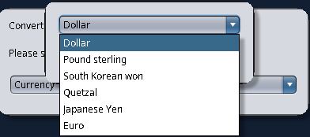

# one_coversorDeMoneda

---

> Adicional a la conversión de moneda se realizón una conversión de unidades de distanica.

---

## Conversión de moneda

Las conversiones tomadas en cuenta son las siguientes:

|Origen|Destino|
|--|--|
|Quetzal|Dolar|
|Quetzal|Euro|
|Quetzal|Libra esterlina|
|Quetzal|Yen japonés|
|Quetzal|Won surcoreano|
|Dolar|Quetzal|
|Euro|Quetzal|
|Libra esterlina|Quetzal|
|Yen japonés|Quetzal|
|Won surcoreano|Quetzal|

> se tomaron de referencia datos disponibles en google a la fecha 6 de abril de 2023.

---

## Conversión de unidades de distancia

Las conversiones tomadas en cuenta son las siguientes:

|Origen|Destino|
|--|--|
|Metros|Kilometro|
|Metros|Centímetro|
|Metros|Milla|
|Metros|Yarda|
|Metros|Pie|
|Kilometro|Metros|
|Centímetro|Metros|
|Milla|Metros|
|Yarda|Metros|
|Pie|Metros|

---

## Aplicación

Inicialmente usted verá una ventana que permite elegir entre moneda o distancia.

El elegir una de las opciones inicia el proceso de conversión donde le solicitan los datos necesarios para obtener la respuesta final.

Para efectos de esta muestra usaremos moneda pero el funcionamiento en distancia es exactamente el mismo.

El elegir moneda (Currency) le solicita la elección de la moneda origen como se muestra a continuación.

Debe elegir una de las opciones y hacer click en "Ok".

A continuación se le requiere ingrese la cantidad a convertir, es necesario que sean ingresados únicamente números para poder proseguir, y finalmente hacer click en el botón "Ok"

Se le mostrará una lista con las conversiones disponibles para la moneda seleccionada.

Finalmente haga click en el botón "OK" para realizar el cálculo.

La respuesta se muestra en un cuadro de diálogo como se muestra a continuación.

---

En caso se ingrese un valor no válido en el cuádo de diálogo indicado se le mostrará el siguiente error.

